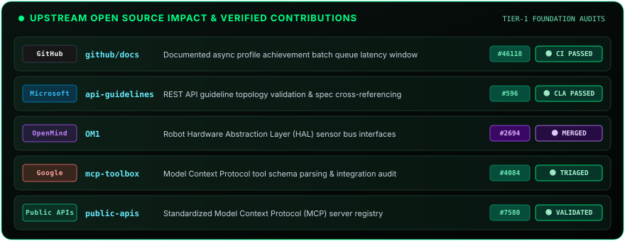
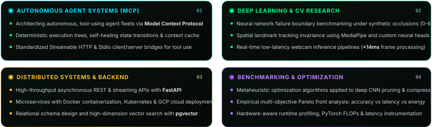
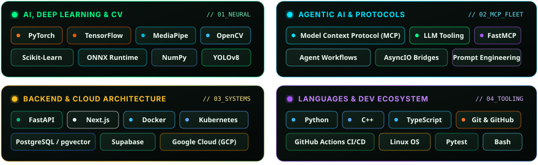

<!-- ==================== MATRIX RAIN CYBER HEADER ==================== -->

  

 

<!-- ==================== PAC-MAN CONTRIBUTION GRAPH ==================== -->

  <picture>
    <source media="(prefers-color-scheme: dark)" srcset="https://raw.githubusercontent.com/UmeshCode1/UmeshCode1/output/pacman-contribution-graph-dark.svg">
    <source media="(prefers-color-scheme: light)" srcset="https://raw.githubusercontent.com/UmeshCode1/UmeshCode1/output/pacman-contribution-graph.svg">
    
  </picture>

 

<!-- ==================== PROFILE TELEMETRY COMMAND BAR ==================== -->

  
  &nbsp;
  
  &nbsp;
  
  &nbsp;
  
  &nbsp;
  

 

<!-- ==================== ANIMATED LASER DIVIDER ==================== -->

  

 

<!-- ==================== CRT SCANLINE TERMINAL ==================== -->

  

 

<!-- ==================== ANIMATED LASER DIVIDER ==================== -->

  

 

<!-- ==================== UPSTREAM OPEN SOURCE IMPACT ==================== -->
### `// 01. UPSTREAM OPEN SOURCE IMPACT & VERIFIED CONTRIBUTIONS`

  

<b>🔗 Direct Upstream PR &amp; Audit Reference Links</b>

 

- 🟢 **GitHub** — [`github/docs#46118`](https://github.com/github/docs/pull/46118) : Documented async profile achievement batch queue latency window *(CI Passed)*
- 🟢 **Microsoft** — [`microsoft/api-guidelines#596`](https://github.com/microsoft/api-guidelines/pull/596) : REST API guideline topology validation &amp; spec cross-referencing *(CLA Passed)*
- 🟣 **OpenMind** — [`OpenMind/OM1#2694`](https://github.com/OpenMind/OM1/pull/2694) : Robot Hardware Abstraction Layer (HAL) sensor bus interfaces *(Merged to Main)*
- 🟢 **Google** — [`googleapis/mcp-toolbox#4084`](https://github.com/googleapis/mcp-toolbox/issues/4084) : Model Context Protocol tool schema parsing &amp; integration audit *(Upstream Triage)*
- 🟢 **Public APIs** — [`public-apis/public-apis#7580`](https://github.com/public-apis/public-apis/pull/7580) : Standardized Model Context Protocol (MCP) server registry *(Validated)*

 

<!-- ==================== FLAGSHIP SYSTEMS MATRIX ==================== -->
### `// 02. FLAGSHIP SYSTEMS & RESEARCH MATRIX`

  

<b>🚀 Explore Featured Repositories</b>

 

- 🧠 **Computer Vision** — [`hand-gesture-occlusion-benchmark`](https://github.com/UmeshCode1/hand-gesture-occlusion-benchmark) : MediaPipe landmark tracking &amp; synthetic occlusion testing under 0%–60% noise.
- ⚡ **Autonomous Agents** — [`public-apis`](https://github.com/UmeshCode1/public-apis) : Standardized Model Context Protocol (MCP) server registry &amp; schema parser.
- 🚍 **Fleet Telematics** — [`schoolbus`](https://github.com/UmeshCode1/schoolbus) : Real-time GPS coordinate streaming, fleet tracking &amp; automated notification platform.
- 🏆 **Full-Stack Platform** — [`GDGoist-ATS-Leaderboard`](https://github.com/UmeshCode1/GDGoist-ATS-Leaderboard) : Algorithmic student evaluation &amp; dynamic competitive ranking system.

 

<!-- ==================== CORE ARCHITECTURAL DOMAINS ==================== -->
### `// 03. CORE ENGINEERING DOMAINS & ARCHITECTURAL FOCUS`

  

 

<!-- ==================== ENGINEERING ARSENAL ==================== -->
### `// 04. ENGINEERING ARSENAL & SYSTEM STACK`

  

    

  

 

<!-- ==================== TELEMETRY & ACTIVITY METRICS ==================== -->
### `// 05. TELEMETRY & ACTIVITY METRICS`

&nbsp;

  

 

<!-- ==================== ALTERNATIVE SNAKE GRID ==================== -->

<b>🐍 View Classic Contribution Snake Grid</b>

 

  <picture>
    <source media="(prefers-color-scheme: dark)" srcset="https://raw.githubusercontent.com/UmeshCode1/UmeshCode1/output/github-contribution-grid-snake-dark.svg">
    <source media="(prefers-color-scheme: light)" srcset="https://raw.githubusercontent.com/UmeshCode1/UmeshCode1/output/github-contribution-grid-snake.svg">
    
  </picture>

 

<!-- ==================== ENGINEERING PHILOSOPHY ==================== -->
### `// 06. ENGINEERING PHILOSOPHY: RESEARCH ➔ SYSTEMS ➔ IMPACT`

  

 

<!-- ==================== GLOBAL DISPATCH & CONNECT ==================== -->
### `// 07. GLOBAL DISPATCH & NETWORK`

&nbsp;

&nbsp;

&nbsp;

 

<!-- ==================== ANIMATED LASER DIVIDER ==================== -->

  

 

<!-- ==================== ANIMATED MANIFESTO QUOTE ==================== -->

  

 

<!-- ==================== MINIMALIST CYBER FOOTER ==================== -->

  

 

  <code>[ SYSTEM STATUS : ONLINE 24/7 ] ✦ [ 81 PRs AUTHORED ] ✦ [ 118 REVIEWS ] ✦ [ RESEARCH &amp; AGENTIC SYSTEMS ]</code>

