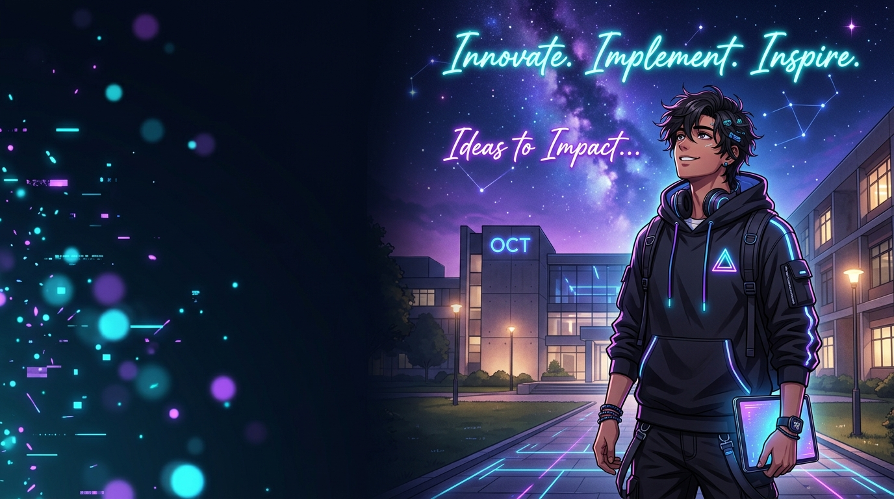
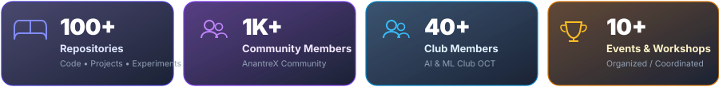
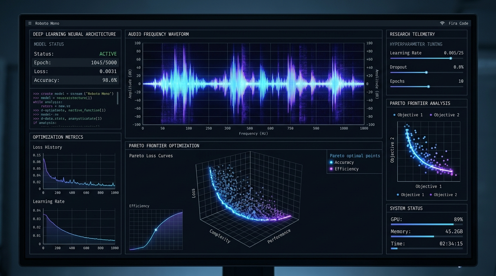
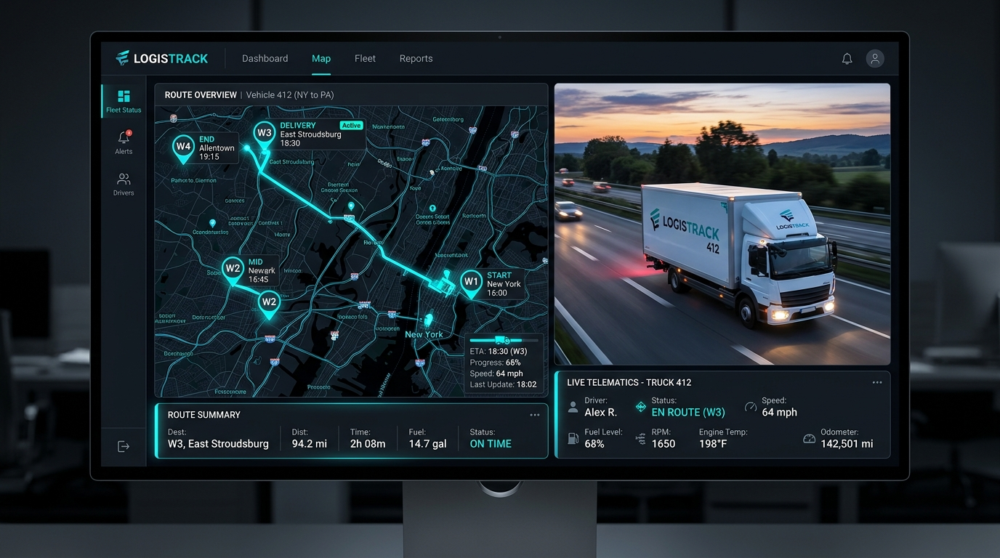
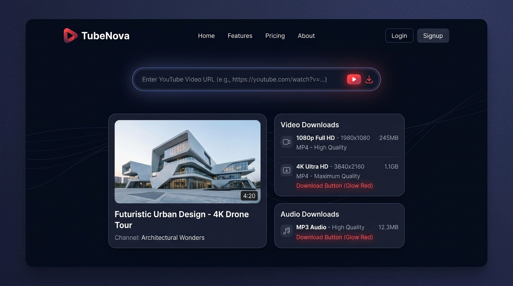
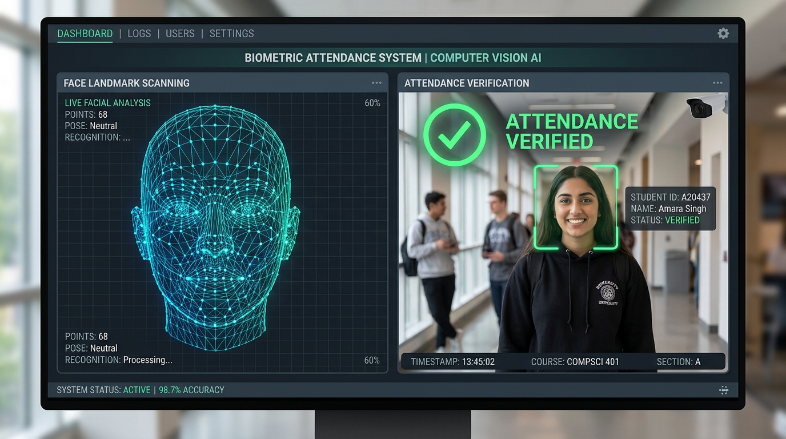
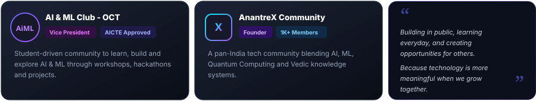
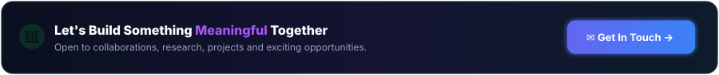

<!-- ==================== HERO SECTION ==================== -->
<table border="0" width="100%">
<tr>
<td width="58%" valign="top">

```text
> Hello, World! 👋
```

# I'm <span style="color:#a855f7">Umesh Patel</span>

**AI/ML Enthusiast · Research Explorer · Full-Stack Developer**  
**Community Builder · Problem Solver**

*B.Tech CSE (AI &amp; ML) @ Oriental College of Technology, Bhopal*  
*Building AI-powered solutions, exploring research, and creating communities to help students grow in tech.*

<br/>

<a href="https://github.com/UmeshCode1?tab=followers" target="_blank">
  
</a>
&nbsp;
<a href="https://linkedin.com/in/umesh-patel-5647b42a4" target="_blank">
  
</a>

<br/><br/>

<a href="https://github.com/UmeshCode1"></a>
<a href="https://linkedin.com/in/umesh-patel-5647b42a4"></a>
<a href="https://www.instagram.com/nycto_phile.i"></a>
<a href="mailto:umesh.code1@gmail.com"></a>
<code>📍 Bhopal, MP</code>

</td>
<td width="42%" align="center" valign="top">



<br/>

<div align="left">
  
  <br/>
  <sub>• <b>Learning &amp; Building:</b> Deep Learning &amp; Neural Architectures</sub><br/>
  <sub>• <b>AI/ML Projects:</b> Occlusion Benchmarking &amp; Vision Models</sub><br/>
  <sub>• <b>Community:</b> AI &amp; ML Club OCT &amp; AnantreX</sub><br/>
  <sub>• <b>Open Source:</b> Contributions to @GitHub, @Microsoft, @Google</sub>
</div>

</td>
</tr>
</table>

<br/>

<!-- ==================== KEY METRIC CARDS ==================== -->
<div align="center">
  
</div>

<br/>

<!-- ==================== PAC-MAN CONTRIBUTION GRAPH ==================== -->
<div align="center">
  <picture>
    <source media="(prefers-color-scheme: dark)" srcset="https://raw.githubusercontent.com/UmeshCode1/UmeshCode1/output/pacman-contribution-graph-dark.svg">
    <source media="(prefers-color-scheme: light)" srcset="https://raw.githubusercontent.com/UmeshCode1/UmeshCode1/output/pacman-contribution-graph.svg">
    
  </picture>
</div>

<br/>

<!-- ==================== ANIMATED LASER DIVIDER ==================== -->
<div align="center">
  
</div>

<br/>

<!-- ==================== TECH STACK SECTION ==================== -->
## 🛠️ Tech Stack &amp; Tooling

<div align="center">


<br/><br/>

<a href="https://skillicons.dev">
  
</a>

</div>

<br/>

<!-- ==================== ANIMATED LASER DIVIDER ==================== -->
<div align="center">
  
</div>

<br/>

<!-- ==================== FEATURED PROJECTS GRID ==================== -->
## 📦 Featured Projects

<table border="0" width="100%">
<tr>

<!-- Project 1 -->
<td width="25%" valign="top">
<a href="https://github.com/UmeshCode1/cnn-optimization-benchmark" target="_blank">
  
</a>
<br/>

<h4>CNN Optimization Benchmark</h4>
<sub>Research platform for empirical benchmarking and optimization of deep CNN compression.</sub>
<br/><br/>
<code>React</code> <code>FastAPI</code> <code>SQLite</code>
<br/><br/>
<a href="https://github.com/UmeshCode1/cnn-optimization-benchmark"><b>View Repository →</b></a>
</td>

<!-- Project 2 -->
<td width="25%" valign="top">
<a href="https://github.com/UmeshCode1/truck_tracker" target="_blank">
  
</a>
<br/>

<h4>TruckTracker</h4>
<sub>Logistics &amp; vehicle trip tracking system with Web and Android app for drivers and managers.</sub>
<br/><br/>
<code>Android</code> <code>Web</code> <code>Mapbox</code>
<br/><br/>
<a href="https://github.com/UmeshCode1/truck_tracker"><b>View Repository →</b></a>
</td>

<!-- Project 3 -->
<td width="25%" valign="top">
<a href="https://github.com/UmeshCode1" target="_blank">
  
</a>
<br/>

<h4>TubeNova</h4>
<sub>YouTube video downloader with clean, modern dark UI and high-resolution stream parsing.</sub>
<br/><br/>
<code>Python</code> <code>yt-dlp</code> <code>Web</code>
<br/><br/>
<a href="https://github.com/UmeshCode1"><b>View Repository →</b></a>
</td>

<!-- Project 4 -->
<td width="25%" valign="top">
<a href="https://github.com/UmeshCode1/FACE_REC-ATT_SYSTEM" target="_blank">
  
</a>
<br/>

<h4>FACE_REC-ATT_SYSTEM</h4>
<sub>Face recognition based biometric attendance system for institutional deployment.</sub>
<br/><br/>
<code>Python</code> <code>OpenCV</code> <code>ML</code>
<br/><br/>
<a href="https://github.com/UmeshCode1/FACE_REC-ATT_SYSTEM"><b>View Repository →</b></a>
</td>

</tr>
</table>

<br/>

<!-- ==================== ANIMATED LASER DIVIDER ==================== -->
<div align="center">
  
</div>

<br/>

<!-- ==================== BENTO ARCHITECTURE & RESEARCH ==================== -->
<div align="center">
  
</div>

<br/>

<!-- ==================== OPEN SOURCE LEADERSHIP ==================== -->
<div align="center">
  <a href="https://github.com/github/docs/pull/46118" target="_blank">
    
  </a>
  &nbsp;
  <a href="https://github.com/microsoft/api-guidelines/pull/596" target="_blank">
    
  </a>
  &nbsp;
  <a href="https://github.com/googleapis/mcp-toolbox/issues/4084" target="_blank">
    
  </a>
  &nbsp;
  <a href="https://github.com/OpenMind/OM1/pull/2694" target="_blank">
    
  </a>
</div>

<br/>

<!-- ==================== ANIMATED LASER DIVIDER ==================== -->
<div align="center">
  
</div>

<br/>

<!-- ==================== GITHUB TELEMETRY & STATS ==================== -->
## 📊 GitHub Telemetry &amp; Stats

<div align="center">

<a href="https://github.com/UmeshCode1">
  
</a>
<a href="https://github.com/UmeshCode1">
  
</a>

<br/>


<br/><br/>


</div>

<br/>

<!-- ==================== CRT SCANLINE TERMINAL (WHOAMI) ==================== -->
<details>
<summary><b>💻 Open Interactive Developer Terminal // <code>$ whoami</code></b></summary>
<br/>
<div align="center">
  
</div>
</details>

<br/>

<!-- ==================== ANIMATED LASER DIVIDER ==================== -->
<div align="center">
  
</div>

<br/>

<!-- ==================== COMMUNITY & LEADERSHIP ==================== -->
## 👥 Community &amp; Leadership

<div align="center">
  
</div>

<br/>

<!-- ==================== ANIMATED LASER DIVIDER ==================== -->
<div align="center">
  
</div>

<br/>

<!-- ==================== FOOTER CTA BANNER ==================== -->
<div align="center">
  <a href="mailto:umesh.code1@gmail.com">
    
  </a>
</div>

<br/>

<!-- ==================== FOOTER ==================== -->
<div align="center">

### Building today. Measuring tomorrow. Rewriting the limits in between.

<sub>© Umesh Patel · UmeshCode1</sub>

</div>
