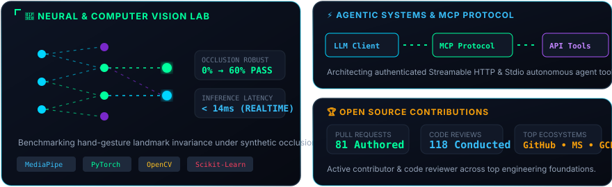

<!-- ==================== MATRIX RAIN CYBER HEADER ==================== -->

  

 

<!-- ==================== PAC-MAN CONTRIBUTION GRAPH ==================== -->

  <picture>
    <source media="(prefers-color-scheme: dark)" srcset="https://raw.githubusercontent.com/UmeshCode1/UmeshCode1/output/pacman-contribution-graph-dark.svg">
    <source media="(prefers-color-scheme: light)" srcset="https://raw.githubusercontent.com/UmeshCode1/UmeshCode1/output/pacman-contribution-graph.svg">
    
  </picture>

 

<!-- ==================== PROFILE TELEMETRY BADGES ==================== -->

  
  &nbsp;
  
  &nbsp;
  
  &nbsp;
  

 

<!-- ==================== CYBER TERMINAL & IDENTITY ==================== -->

  

 

<!-- ==================== ANIMATED LASER DIVIDER ==================== -->

  

 

<!-- ==================== BENTO ARCHITECTURE & RESEARCH ==================== -->

  

 

<!-- ==================== OPEN SOURCE LEADERSHIP ==================== -->

  
  &nbsp;
  
  &nbsp;
  
  &nbsp;
  

 

<!-- ==================== ANIMATED LASER DIVIDER ==================== -->

  

 

<!-- ==================== TECH STACK & TOOLING ==================== -->

  <h3>⚡ Core Stack &amp; Tooling</h3>
  

 

<!-- ==================== GITHUB TELEMETRY & STATS ==================== -->

  <h3>📊 GitHub Journey &amp; Telemetry</h3>

  <table align="center" border="0">
    <tr>
      <td>
        
      </td>
      <td>
        
      </td>
    </tr>
  </table>

  

    
  

  

    
  

 

<!-- ==================== SNAKE ANIMATION ==================== -->

<b>🐍 View Classic Contribution Snake Grid</b>

 

  <picture>
    <source media="(prefers-color-scheme: dark)" srcset="https://raw.githubusercontent.com/UmeshCode1/UmeshCode1/output/github-contribution-grid-snake-dark.svg">
    <source media="(prefers-color-scheme: light)" srcset="https://raw.githubusercontent.com/UmeshCode1/UmeshCode1/output/github-contribution-grid-snake.svg">
    
  </picture>

 

<!-- ==================== ANIMATED LASER DIVIDER ==================== -->

  

 

<!-- ==================== CONNECT WITH ME ==================== -->

  <h2>🤝 Let's Connect &amp; Build</h2>

  
  &nbsp;&nbsp;
  
  &nbsp;&nbsp;
  
  &nbsp;&nbsp;
  
  &nbsp;&nbsp;
  

 

<!-- ==================== FOOTER ==================== -->

  

