<!-- ==================== HERO SECTION ==================== -->
<div align="center">
  
</div>

<div align="center">
  <a href="https://github.com/UmeshCode1">
    
  </a>
</div>

<!-- ==================== PROFILE TELEMETRY BADGES ==================== -->
<div align="center">
  
  &nbsp;
  <a href="https://github.com/UmeshCode1?tab=followers">
    
  </a>
  &nbsp;
  <a href="https://github.com/UmeshCode1?tab=repositories">
    
  </a>
  &nbsp;
  <a href="https://github.com/UmeshCode1">
    
  </a>
</div>

<br />

<!-- ==================== ANIMATED DIVIDER ==================== -->
<div align="center">
  
</div>

<br />

<!-- ==================== BENTO GRID ARCHITECTURE & RESEARCH ==================== -->
<div align="center">
  
</div>

<br />

<!-- ==================== OPEN SOURCE LEADERSHIP ==================== -->
<div align="center">
  <a href="https://github.com/github/docs/pull/46118" target="_blank">
    
  </a>
  &nbsp;
  <a href="https://github.com/microsoft/api-guidelines/pull/596" target="_blank">
    
  </a>
  &nbsp;
  <a href="https://github.com/googleapis/mcp-toolbox/issues/4084" target="_blank">
    
  </a>
  &nbsp;
  <a href="https://github.com/OpenMind/OM1/pull/2694" target="_blank">
    
  </a>
</div>

<br />

<!-- ==================== ANIMATED DIVIDER ==================== -->
<div align="center">
  
</div>

<!-- ==================== ABOUT ME ==================== -->
<h2>
  
  <b>About Me </b>
  
</h2>

```python
class UmeshPatel:
    def __init__(self):
        self.name = "Umesh Patel"
        self.role = "AI & ML Systems Engineer"
        self.college = "Oriental College of Technology, Bhopal"
        self.location = "India"
        self.languages = ["Python", "JavaScript", "SQL", "C++"]
        self.core_focus = ["Deep Learning", "Computer Vision", "Agentic Systems (MCP)", "Cloud Systems"]
    
    def say_hi(self):
        print("Thanks for dropping by! Let's build something amazing together!")

me = UmeshPatel()
me.say_hi()
```

<!-- ==================== WHAT I'M UP TO ==================== -->
<h2>
  
  What I'm Up To
</h2>

- 🔬 Benchmarking **Deep Learning & Computer Vision Invariance** under partial synthetic occlusions
- ⚡ Architecting **Model Context Protocol (MCP)** tools and autonomous agent environments
- 🌐 Actively contributing to top-tier open-source foundations (**@github**, **@microsoft**, **@googleapis**)
- 👯 Looking to collaborate on **Cutting-Edge Multimodal & Embodied AI**
- 💬 Ask me about **AI, ML, Cloud Infrastructure, and Agentic Architectures**
- 📧 Reach me at **umesh.code1@gmail.com**
- ☕ Fun fact: **I turn chai into code and data into insights**

<!-- ==================== ANIMATED DIVIDER ==================== -->
<div align="center">
  
</div>

<!-- ==================== TECH STACK & TOOLING ==================== -->
<h2>
  
  Tech Stack &amp; Tooling
</h2>

<div align="center">
  <a href="https://skillicons.dev">
    
  </a>
</div>

<br />

<!-- ==================== ANIMATED DIVIDER ==================== -->
<div align="center">
  
</div>

<!-- ==================== GITHUB TELEMETRY ==================== -->
<h3 align="center">
  &nbsp;
  
</h3>

<table align="center" border="0">
  <tr>
    <td>
      <a href="https://github.com/UmeshCode1">
        
      </a>
    </td>
    <td>
      <a href="https://github.com/UmeshCode1">
        
      </a>
    </td>
  </tr>
</table>

<p align="center">
  
</p>

<!-- Dynamic Quote Card -->
<div align="center">
  
</div>

<br />

<!-- ==================== ACHIEVEMENTS & CONTRIBUTIONS ==================== -->
<h3 align="center">
  &nbsp;
  GitHub Achievements &amp; Trophies
</h3>

<p align="center">
  
</p>

<h3 align="center">
  &nbsp;
  Activity Overview
</h3>

<p align="center">
  
</p>

<!-- ==================== GITHUB CONTRIBUTION SNAKE ==================== -->
<h2 align="center">
  
  GitHub Contribution Grid Snake
</h2>

<div align="center">
  <picture>
    <source media="(prefers-color-scheme: dark)" srcset="https://raw.githubusercontent.com/UmeshCode1/UmeshCode1/output/github-contribution-grid-snake-dark.svg">
    <source media="(prefers-color-scheme: light)" srcset="https://raw.githubusercontent.com/UmeshCode1/UmeshCode1/output/github-contribution-grid-snake.svg">
    
  </picture>
</div>

<br />

<!-- ==================== ANIMATED DIVIDER ==================== -->
<div align="center">
  
</div>

<!-- ==================== CONNECT WITH ME ==================== -->
<h2 align="center">
  
  Let's Connect!
</h2>

<div align="center">
  <a href="https://linkedin.com/in/umesh-patel-5647b42a4" target="_blank">
    
  </a>
  &nbsp;&nbsp;
  <a href="mailto:umesh.code1@gmail.com" target="_blank">
    
  </a>
  &nbsp;&nbsp;
  <a href="https://github.com/UmeshCode1" target="_blank">
    
  </a>
  &nbsp;&nbsp;
  <a href="https://wa.me/7974389476" target="_blank">
    
  </a>
  &nbsp;&nbsp;
  <a href="https://www.instagram.com/nycto_phile.i" target="_blank">
    
  </a>
</div>

<br />

<!-- ==================== FOOTER ==================== -->
<div align="center">
  
</div>
